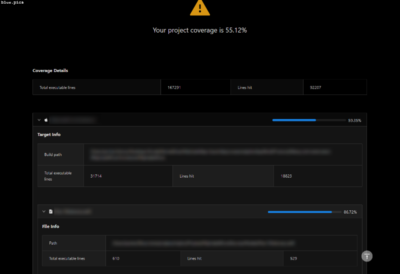

# Xcode Code Coverage
This project was born out of a need to share Xcode native code coverage reporting with individuals who are not able to
use Xcode.

### User Story
I am a user who needs to share details of my native Xcode project's code coverage with a QA manager. When I upload a 
code coverage JSON file to the website, it should display all the data in an easy to digest manner. There should be:
- A project overview of total coverage
- A per-target overview
- A per-file overview
- A per-function overview

All the generation and parsing should be done client-side such that an org need not worry about sharing sensitive
code-coverage data. 

### Screenshot

### Live URL